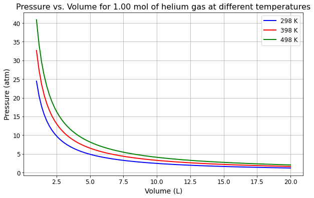
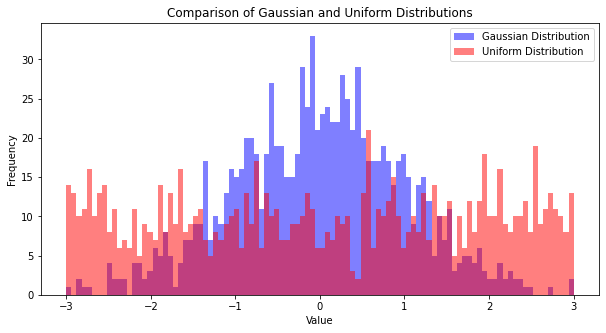
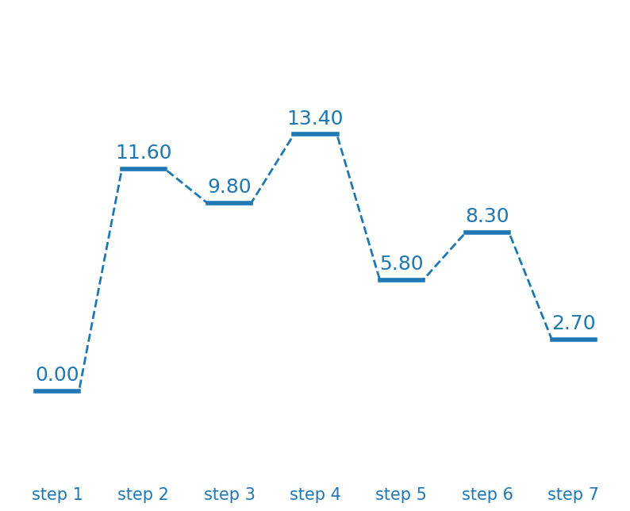

This is the **Principle** part of ***Computational Materials Science: From Algorithm principle to Code Implementation***.

<div style="color:black; background-color:#FFF3E9; border: 1px solid #FFE0C3; border-radius: 10px; margin-bottom:0rem">
    <p style="margin:1rem; padding-left: 1rem; line-height: 2.5;">
        ©️ <b><i>Copyright 2024 @ Jianghai Wang</i></b><br/>
        <i>Author：
            <b>
            <a href="mailto:wang_jianghai@buaa.edu.cn">Jianghai Wang 📨 </a>
            </b>
        </i>
        <br/>
        <i>Date：2024-03-10</i><br/>
        <i>License：<a rel="license" href="http://creativecommons.org/licenses/by-nc-sa/4.0/">CC BY-NC-SA 4.0</a></i><br/>
    </p>
</div>

> **代码实现**：
> 
> - [Python Implementation: ***Lennard-Jones Potential***](https://github.com/Ocean-JH/CMS_Notes/blob/main/Molecular%20Dynamics/notebook/Python%20Implementation%EF%BC%9ALennard-Jones%20Potential.ipynb)
> - [Python Implementation: ***Optimization Algorithms for Molecular Dynamics***](https://github.com/Ocean-JH/CMS_Notes/blob/main/Molecular%20Dynamics/notebook/Python%20Implementation%EF%BC%9AOptimization%20Algorithms%20for%20Molecular%20Dynamics.ipynb)
> - [Python Implementation: ***Integration Algorithms for Molecular Dynamics***](https://github.com/Ocean-JH/CMS_Notes/blob/main/Molecular%20Dynamics/notebook/Python%20Implementation%EF%BC%9AIntegration%20Algorithms%20for%20Molecular%20Dynamics.ipynb)
> 
> **LAMMPS实例**：
> - [《计算材料学》（分子动力学）LAMMPS实例](/_posts/2024-05-07-notes-of-cms-practice.md)


# 计算材料学简介

---


## 1. 计算方法分类

### 纳观尺度

**基本粒子**：电子

**主要理论**：量子力学

$$
i\hbar\frac{\partial\psi}{\partial t}=-\frac{\hbar^2}{2m}\frac{\partial^2\psi}{\partial x^2}
$$

**主要方法**：基于量子化学、密度泛函理论（DFT）的第一性原理计算

**常用软件**：VASP、Gaussian、Quantum Espresso

**计算内容**：

- 结构性质：分子、晶体结构预测

- 表面性质：重构、缺陷、表面能

- 力学性质：弹性常数、杨氏模量

- 磁学性质：磁性、自旋轨道耦合

- 电子性质：分子轨道、能带结构、价态

- 光学性质：吸收光谱、折射率

- 动力学模拟：扩散系数、反应动力学过程

### 微观尺度

> 当原子[**德布罗意波长**](https://en.wikipedia.org/wiki/Matter_wave "德布罗意波，也称为物质波（英语：Matter waves）是量子力学理论的中心部分，同时也是波粒二象性的一个例子。该理论指出所有物质都表现出波动性。")远小于晶格常数时，可以用牛顿经典力学近似描述原子的运动。

**基本粒子**：原子

**主要理论**：牛顿力学

$$
\overrightarrow{F}=m\overrightarrow{a}
$$

**主要方法**：蒙特卡洛（MC）、分子动力学（MD）

**常用软件**：LAMMPS、GROMACS

**计算内容**：

- 力学性质：微观塑性变形机制、拉伸断裂机理

- 热学性质：相变、热膨胀系数

- 物质结构/相互作用：吸附、扩散、缺陷运动、超分子自组装、表面能

### 介观尺度

**基本粒子**：粗粒子（或组织、结构）

**主要理论**：牛顿力学、统计热力学

**主要方法**：

- 格子玻尔兹曼（LBM）

- 耗散粒子动力学（DPD）

- 布朗动力学（BD）

- 位错动力学（DDD）

- 相变动力学（PTD）

**常用软件**：LAMMPS、GROMACS

### 宏观尺度

**基本粒子**：连续体

**主要理论**：理论力学、流体力学

**主要方法**：

- 有限元法（FEM）

- 有限差分法（FDM）

- 有限体积法（FVM）

常用软件：ANSYS、ABAQUS

**计算内容**：

- 冲击损伤仿真

- 力/热/电/磁场耦合分析

- 温度分布模拟

- 切削表面形成过程

- 裂纹的扩展及应力分布等


## 2. 计算材料基本流程  


1. 确定物理模型（误差来源）

2. 选择数值方法（误差来源）

3. 分析计算结果（数值结果的选取）

4. 得到物理结论


# Python与科学计算

---

## Python基础


Python语言特点

1. 开源
2. 跨平台
3. 可扩展
4. 运行速度有限

### 1. [斐波那契数列](https://en.wikipedia.org/wiki/Fibonacci_sequence "斐波那契数列由0和1开始，之后的斐波那契数是由之前的两数相加而得出。")


```python
def fibonacci(n):
    if n==1 or n==2:
        return 1
    else:
        return fibonacci(n-1) + fibonacci(n-2)
```


```python
fibonacci(21)
```


    10946


### 2. 字符串反转


```python
def rev_strs(strs):
    strs.reverse()
    reversed_strs = []
    for string in strs:
        rev_str = string[::-1]
        reversed_strs.append(rev_str)
    return reversed_strs
```


```python
strs = ['we', 'love', 'python']
rev_strs(strs)
```


    ['nohtyp', 'evol', 'ew']


### 3. 因式分解


```python
def factorization(num):
    factor = []
    while num > 1:
        for i in range(num - 1):
            k = i + 2
            if num % k == 0:
                factor.append(k)
                num = int(num / k)
                break

    return factor
```


```python
factorization(2001)
```


    [3, 23, 29]


## Python模块


-  **Numpy——科学计算**  
-  **Matplotlib——科学作图**

### 1. Numpy数组操作


```python
import numpy as np

a = np.random.randint(0, 100, size=(5, 5))

b = a.copy()

b[b < 30] = 30
b[b > 70] = 70

print(a)
print(b)
```

    [[58 26 29 68  0]
     [66 54  7 10 51]
     [47 58 16 72 98]
     [73  7 42  3 91]
     [74 97 53 27 36]]
    [[58 30 30 68 30]
     [66 54 30 30 51]
     [47 58 30 70 70]
     [70 30 42 30 70]
     [70 70 53 30 36]]


### 2. 理想气体状态方程可视化


```python
import matplotlib.pyplot as plt
import numpy as np

# 定义常量
R = 0.08206  # L·atm/mol·K
n = 1.00  # mol
T1 = 298  # K
T2 = 398  # K
T3 = 498  # K

# 体积采样
V = np.linspace(1, 20, 100)  # 生成体积的等间距取样点

# 使用理想气体状态方程PV = nRT计算压力
P1 = n * R * T1 / V  # 298K下的压力
P2 = n * R * T2 / V  # 398K下的压力
P3 = n * R * T3 / V  # 498K下的压力

# 绘制图表
plt.figure(figsize=(10, 6))
plt.plot(V, P1, 'b-', linewidth=2, label='298 K')  # 绘制298K下的曲线
plt.plot(V, P2, 'r-', linewidth=2, label='398 K')  # 绘制398K下的曲线
plt.plot(V, P3, 'g-', linewidth=2, label='498 K')  # 绘制498K下的曲线
plt.title('Pressure vs. Volume for 1.00 mol of helium gas at different temperatures', fontsize=16)
plt.xlabel('Volume (L)', fontsize=14)
plt.ylabel('Pressure (atm)', fontsize=14)
plt.grid(True)
plt.legend(fontsize=12)
plt.tick_params(axis='both', labelsize=12)
plt.show()
```


​    

​    


## Python综合练习

### 1. 饼图——地球大气成分可视化


```python
import matplotlib.pyplot as plt

labels = ['$\mathregular{N_2}$', '$\mathregular{O_2}$', 'Others']
percents = (78, 21, 1)
explode = (0, 0, 0.1)


plt.title('Composition distribution of the Earth\'s atmosphere')
plt.pie(percents, labels=labels, explode=explode, autopct='%1.1f')
plt.axis('equal')

plt.legend(loc='best')
plt.show()
```


​    

​    


### 2. 直方图


```python
import random
import numpy as np
import matplotlib.pyplot as plt

# 生成高斯分布的随机数值
mean = 0  # 均值
std_dev = 1  # 标准差
gaussian_values = np.random.normal(mean, std_dev, 1000)

# 生成均匀分布的随机数值
random_values = np.random.uniform(-3, 3, 1000)

# 创建直方图
plt.figure(figsize=(10, 5))
plt.hist(gaussian_values, bins=100, alpha=0.5, color='b', label='Gaussian Distribution', range=(-3, 3))
plt.hist(random_values, bins=100, alpha=0.5, color='r', label='Uniform Distribution', range=(-3, 3))

# 添加标题和标签
plt.title('Comparison of Gaussian and Uniform Distributions')
plt.xlabel('Value')
plt.ylabel('Frequency')
plt.legend()

# 显示直方图
plt.show()

```


​    

​    


### 3. 化学反应台阶图

镍膦催化剂结合和分裂$H_2$(g)过程中每个步骤的自由能

| Step | Relative Free Energy (kcal/mol) |
|:----:|:-------------------------------:|
|  1   | 0.0                             |
|  2   | 11.6                            |
|  3   | 9.8                             |
|  4   | 13.4                            |
|  5   | 5.8                             |
|  6   | 8.3                             |
|  7   | 2.7                             |


数据来源：[*Inorg. Chem.* **2016**, 55, 445−460](https://doi.org/10.1021/acs.inorgchem.5b02262)

注：以下代码参考了[**化学反应台阶图快速绘制**](https://nb.bohrium.dp.tech/detail/4934994790)与[**Python脚本提取数据绘制电化学台阶图**](https://jonyafei.github.io/2021/06/20/python%E8%84%9A%E6%9C%AC%E6%8F%90%E5%8F%96%E6%95%B0%E6%8D%AE%E7%BB%98%E5%88%B6%E7%94%B5%E5%8C%96%E5%AD%A6%E5%8F%B0%E9%98%B6%E5%9B%BE/)


```python
import copy

import numpy as np
import matplotlib.pyplot as plt

from cycler import cycler
from dataclasses import dataclass
from typing import List, Optional
from pathlib import Path
```


```python
@dataclass
class StepsGraph:
    data: list
    legend_txt: str = None
    labels: List[str] = None

    def __post_init__(self):
        if self.labels:
            if len(self.data) != len(self.labels):
                raise ValueError("The lengths of data and labels must be equal.")

    def plot_line_dot(
            self,
            ax: plt.Axes,
            color: Optional[str] = None,
            path_label: str = None,
            energy_label: bool = False, energy_label_fontsize=18,
            step_label: List[str] = None, step_label_fontsize=12,
    ):
        y = copy.deepcopy(self.data)
        y_max, y_min = np.max(y), np.min(y)  # 获取y值的最大值和最小值
        y_bias = (y_max - y_min) / 25  # 获取文本标签y方向偏移量
        x = range(len(y))
        if path_label is None:
            path_label = self.legend_txt
        if step_label is None:
            step_label = self.labels
        y_new = []
        x_new = []
        # 1.生成新的XY坐标点，个数加倍
        for j in range(len(y)):
            y_new.append(y[j])
            y_new.append(y[j])
            x_new.append(2 * j)
            x_new.append(2 * j + 1)
        # 2.绘制虚线折线图
        if color is None:
            color = next(ax._get_lines.prop_cycler)['color']
        ax.plot(x_new, y_new, linestyle='--', linewidth=2, color=color,
                )

        # 3.绘制实线折线图
        k = 0
        while k < len(y_new):
            x_line = [x_new[k], x_new[k + 1]]
            y_line = [y_new[k], y_new[k + 1]]
            ax.plot(x_line, y_line, linestyle='-', linewidth=4, color=color, label=path_label if k == 0 else None)
            k += 2

        # 4.标记能量值，偏移量视具体情况而定
        if energy_label:
            for j in range(len(x)):
                ax.text(x[j] * 2 + 0.5, y[j] + y_bias, "{:.2f}".format(y[j]), fontsize=energy_label_fontsize,
                        color=color, horizontalalignment='center')

        now_minx, now_maxx = ax.get_xlim()
        now_miny, now_maxy = ax.get_ylim()
        if step_label:
            for j in range(len(x)):
                ax.text(
                    (x[j] * 2 + 0.5 - now_minx) / (now_maxx - now_minx),
                    0,
                    step_label[j],
                    fontsize=step_label_fontsize,
                    color=color,
                    horizontalalignment='center',
                    verticalalignment='top',
                    transform=ax.transAxes
                )
        ax.set_xticks([])
        ax.set_xticklabels([])
```


```python
figure = plt.figure(figsize=(10, 8), dpi=100)
ax = figure.add_subplot(111)
cmap = plt.get_cmap('tab20')
ax.set_prop_cycle(cycler('color', cmap.colors))

labels = ["step 1", "step 2", "step 3", "step 4", "step 5", "step 6", "step 7"]
energy = [0.0, 11.6, 9.8, 13.4, 5.8, 8.3, 2.7]
stepgraph_ins1 = StepsGraph(data=energy, labels=labels)
stepgraph_ins1.plot_line_dot(ax, energy_label=True, step_label_fontsize=15)
# ax.legend(fontsize=14)
ax.set_ylim(-5, 20)
ax.axis('off')

plt.show()
```


​    

​    


# 分子动力学简介

---


> [分子动力学](https://en.wikipedia.org/wiki/Molecular_dynamics)（Molecular Dynamics, MD）是一种通过**数值模拟**方法研究分子、原子或粒子系统在**经典力学**下时间演化的计算技术。分子动力学方法可以观察分析分子系统在微观尺度上的动态行为，通过**统计物理**的方法建立体系微观和宏观之间的关系。


### [并行计算](https://en.wikipedia.org/wiki/Parallel_computing)

由于受力的计算都是局域的，因此分子动力学的并行相对简单。

- 共享内存：多个处理器（核心）共享相同的内存。通过线程在核心之间分配工作。

- 分布式内存：处理器（节点）拥有自己的内存
  
  - 但程序多数据（SPMD）
  
  - 数据需要间歇性与其他节点共享
  
  - **域分解**（将模拟盒分解为物理域）是可行的，尤其是在短程相互作用中


> **域分解**：每个处理器拥有一部分仿真域以及其中的原子，处理器的域还扩展到包括所需的虚原子（**Ghost atoms**，位于其他处理器上的原子副本）。


### 常用分子动力学软件

| Software                          | Copyright                |
|:---------------------------------:|:------------------------:|
| GROMACS                           | Open Source              |
| [LAMMPS](https://www.lammps.org/) | <mark>Open Source</mark> |
| AMBER                             | Commercial               |
| NAMD                              | Open Source              |
| DL_PLOY                           | Commercial               |
| Materials Studio                  | Commercial               |


## 分子动力学基本步骤


### 一 输入信息：

- 初始位置和速度

- 边界条件

- 原子间作用势


#### 1.1 位置和速度

初始位置：随机生成；

初始速度：一般按照玻尔兹曼分布或者高斯分布取得，通常计算前检查**粒子总动量为零**，否则由于系统本身产生移动而导致总能量不稳定。

**Maxwell-Boltzmann速率分布：**

$$
f(v)=\frac{4}{\sqrt{\pi}}\left(\frac{m}{2 k T}\right)^{3 / 2} v^2 e^{-\frac{m v^2}{2 k T}}
$$

例：使用Python产生随机原子坐标

```python
#!/usr/bin/env python
def genRandomAtoms(natoms, atom_types = 1, system_size = 10, outputFileName = 'randomAtoms.dat’):
    ......
    # Generate random atom positions
    dim = 3 # 3 dimensional
    minDist = 0.3 # minimum required distance between atoms
    positions = np.zeros((natoms,dim))
    positions[0] = np.random.rand(dim)
    for i in range(1,natoms):
        iter, maxIter = 0, 1e5
        while True and iter<maxIter:
            iter += 1
            newpos = np.random.rand(dim)*system_size
            dist = newpos-positions[0:i]
            if np.all( np.linalg.norm(dist,axis=1) > minDist ):
                break
        assert(iter<maxIter)
        positions[i]= newpos
```

#### 1.2 边界条件

- 周期性边界条件：晶体、周期性流动体系

- 包裹边界条件：孤立大分子、纳米颗粒

- 固定边界条件：薄膜生长


#### 1.3 原子间作用势

> **原子间相互作用势**是描述原子间相互作用关系的函数或模型，是原子模拟的最关键技术，直接决定了原子模拟结果的可靠性。

参考链接：[Interatomic Potentials Repository (nist.gov)](https://www.ctcms.nist.gov/potentials/)


$$
V(\boldsymbol{r})=\sum_{\mathrm{ij}} V_{\mathrm{ij}}\left(\boldsymbol{r}_{\mathrm{i}}, \boldsymbol{r}_{\mathrm{j}}\right)+\sum_{\mathrm{ijk}} V_{\mathrm{ijk}}\left(\boldsymbol{r}_{\mathrm{i}}, \boldsymbol{r}_{\mathrm{j}}, \boldsymbol{r}_{\mathrm{k}}\right)+\sum_{\mathrm{ijkl}} V_{\mathrm{ijkl}}\left(\boldsymbol{r}_{\mathrm{i}}, \boldsymbol{r}_{\mathrm{j}}, \boldsymbol{r}_{\mathrm{k}}, \boldsymbol{r}_{\mathrm{l}}\right) \ldots
$$


按照**多体相互作用的数目**分类：

- 二体势：Lennard-Jones势、Morse势

- 三体势：Tersoff势

- 多体势：嵌入原子势、反应力场、**机器学习势**

机器学习势基于第一性原理数据驱动，除此以外的势函数又称**半经验势**。

实际应用中应根据模拟对象的**键合类型**选择合适的原子间作用势。


### 二 时间步演化

#### 2.1 力的计算

##### 2.1.1 近邻列表

在分子动力学过程中通常维护一个近邻列表来加速原子受力的计算。

```python
for I in particles:
    for J in nn_List[I]:
        force[I] += F(I, J)
        ......
```

##### 2.1.2 原子间相互作用

$$
V(r)=4 \varepsilon\left[\left(\frac{\sigma}{r}\right)^{12}-\left(\frac{\sigma}{r}\right)^6\right]
$$

前一项是短程排斥作用的Pauli exclusion principle；后一项是远程吸引作用的London dispersion。

此外，原子间相互作用不仅包含成键作用，还包含非成键作用。

#### 2.2 时间步积分

##### 2.2.1 动力学演化

分子动力学模拟包含两方面内容：

- 构型优化
  
  在分子动力学中，寻找系统的最低势能状态通常涉及到大量变量与复杂的目标函数，需要专门的优化算法，如最速下降、共轭梯度等。

- 动力学演化
  
  N个原子组成的分子体系，第$i$个原子运动的牛顿方程是：
  
  $$
  f_i=m_i \frac{d^2 r_i}{d t^2}=m_i \bar{r}_i \cdots(\mathrm{i}=1,2,3, \ldots, \mathrm{N})
  $$
  
  对其速度进行积分即为粒子的**位置轨迹**：
  
  $$
  r(t)=\int_0^t v(t) d t \longrightarrow\left\{\begin{array}{l}r(t+\Delta t)=r(t)+v(t) \Delta t+O\left(\Delta t^2\right) \\ v(t+\Delta t)=v(t)+\frac{F(t)}{m} \Delta t+O\left(\Delta t^2\right)\end{array}\right.
  $$
  
  通过算法对下一时刻原子速度和位置进行求解。算法主要包括：
  
  - Euler算法
  
  - Velert算法
  
  - Leap-frog算法
  
  - Velocity-velert算法

##### 2.2.2 步长选择

简单原则：步长$\Delta t$的选取必须保证体系能量守恒，且轨迹具有时间可逆性。

复杂要求：当系统中存在多个不同时间尺度时，例如不同质量的混合粒子，溶剂聚合体，柔性和刚性的共存分子等，步长的选择必须依照体系中**动力学变化最快**的成分或模型。

| Motion                          | Time Scale (sec)         |
|:------------------------------- |:------------------------:|
| Bond stretching                 | $10^{-14}$ to $10^{-13}$ |
| Elastic vibrations              | $10^{-12}$ to $10^{-11}$ |
| Rotations of surface sidechains | $10^{-11}$ to $10^{-10}$ |
| Hinge bending                   | $10^{-11}$ to $10^{-7}$  |
| Rotations of buried side chains | $10^{-4}$ to 1           |
| Allosteric transistions         | $10^{-5}$ to 1           |
| Local denaturations             | $10^{-5}$ to 10          |

- 动力学模拟受限于最高频率

- 时间步长应约为最高频率的**1/10**

**时间步长**：1 fs $(10^{-15}s)$


#### 2.3 温度与压强控制

实际分子动力学模拟中，能量守恒体系非常少见：

1. 能量守恒的$NVE$系综通常不能真实反映体系所处的实验情况；

2. 分子动力学的算法误差积累倾向于使体系受热。

可以通过将体系连接到**热浴**的方法吸收多余的热量。


> [**系综**(Ensemble)](https://en.wikipedia.org/wiki/Ensemble_(mathematical_physics) "在统计物理中，系综(Ensemble)代表一定条件下一个体系的大量可能状态的集合。也就是说，系综是系统状态的一个概率分布。")是由具有相同宏观条件（例如体积、能量、温度等）的许多微观态组成的集合。这些微观态在某一时刻可以被看作是系统的一个可能的状态。通过研究这些微观态的统计行为，可以得到系统的平均宏观性质。


#### 2.4 采样和平衡

##### 2.4.1 趋衡过程

> 当系统刚刚完成初始化，或者某个模拟参量发生变化时，体系通常会处于非平衡态。这时候体系的各项性质会随着时间步而漂移，趋向于新的平衡态，这个过程叫做**趋衡过程**。经过一段时间后，体系持续给出确定能量值，我们称这时系统达到平衡态，达到平衡态所需的时间称为**弛豫时间**。

##### 2.4.2 采样过程

分子动力学方法通过**统计平均**的方法获得平衡体系的物理量。在**平衡后的模拟过程**中收集数据进行统计分析。


### 三 后处理过程

#### 3.1 属性计算

MD是一种**统计力学**方法：它生成一组符合统计分布规律的构型，通过计算**<mark>系综平均</mark>**来得到物理量的宏观测量值(长时间平均值)。我们一般不感兴趣单个原子的轨迹，而是通过对所有原子/时间进行平均，从而获得热力学量及宏观性质。


> [**各态历经假说(Ergodic hypothesis)**](https://en.wikipedia.org/wiki/Ergodic_hypothesis)：对于一个处于平衡的体系，物理量的时间平均，等于对对应系综里所有体系进行平均的结果。
> 
> - 时间平均：
> 
>$$
\overline{A}=\lim\limits_{\tau\to\infty}\frac{1}{\tau}{\int}_{\iota_0}^{\iota_0+\tau}A(\mathbf{q},\mathbf{p},t)\mathrm{d}t
$$
> 
> - 系综平均：
> 
> $$
\langle A\rangle=\sum_\text{all states}{ A _ r p _ r}
$$
> 
> 统计力学中的系综平均$<A>$是力学量$A$对所有可实现微观状态的加权平均。
> 
> 当热力学体系符合**各态历经假设**或**准各态历经假设**时，以上两种方法计算得到的平均值完全一致。

物理量大致可以分为以下几类：

- 结构表征
  
  径向分布函数，动态结构因子等

- 状态方程
  
  自由能函数，相图，热膨胀系数等

- 输运性质
  
  粘度，热导率，相关函数，扩散系数等


| Property    | Definition                                                                                                                                                                                                                                  | Application                                    |
|:-----------:|:-------------------------------------------------------------------------------------------------------------------------------------------------------------------------------------------------------------------------------------------:|:----------------------------------------------:|
| Temperature | $T=\frac{1}{3} \frac{1}{N k_B}<\sum_{i=1}^N m_i \vec{v}_i^2>\quad \vec{v}_i^2=\vec{v}_i \cdot \vec{v}_i$                                                                                                                                      | Direct                                         |
| Pressure    | $P=\frac{1}{3 V}<\sum_{i=1}^N\left(m_i \vec{v}_i^2+\vec{r}_i \cdot \vec{f}_i\right)>$                                                                                                                                                         | Direct                                         |
| Stress      | $\sigma_{i j}=\frac{1}{\Omega}<\left(-\sum_\alpha m_\alpha u_{\alpha, i} u_{\alpha, j}+\left.\frac{1}{2} \sum_{\alpha, \beta, a \neq \beta} \frac{\partial \phi(r)}{\partial r} \frac{r_i}{r} \cdot r_j\right\|_{r=r_{\alpha \beta}}\right)>$ | Direct                                         |
| MSD         | $<\Delta r^{2}(t)>=\frac{1}{N} \sum_{i}\left(r_{i}(t)-r_{i}(t=0)\right)^{2}$                                                                                                                                                                  | Diffusivity                                    |
| RDF         | $g(r)=<\frac{N\left(r \pm \frac{\Delta r}{2}\right)}{\Omega\left(r \pm \frac{\Delta r}{2}\right) \rho}>$                                                                                                                                      | Atomic structure (signature)                   |
| VAF         | $<v(0)v(t)>=\frac{1}{N}\sum_{i=1}^{N}\frac{1}{N_{i}}\sum_{k=1}^{N_{i}}v_{i}(t_{k} )v_{i}(t_{k}+t)$                                                                                                                                            | Diffusivity, phase state, transport properties |


#### 3.2 分析与可视化


## 分子动力学的优势与局限

- 优势：
  
  - 与第一性原理计算（量子力学）和有限元计算（连续介质力学）可以很好衔接
  
  - 提供了原子和分子层面的详细信息
  
  - 适用于多个领域，能够模拟不同系统和条件

**MD是一个确定性的过程**：给定初始位置和速度，体系随时间的演变原则上是完全确定的。MD方法的一大优点是研究**快速非平衡过程**时具有原子级分辨率（例如由于冲击波引起的损伤/塑性变形，动态断裂和裂纹扩展，离子轰击，簇冲击等等）。对于许多这类问题，除了MD方法外没有其他选择。


- 分子动力学适用条件：

在分子动力学模拟中用牛顿方程替代了原子核的薛定谔方程。

此近似有效性的一个重要判据是**德布罗意波长**：当德布罗意波长远大于粒子间距的时候，量子效应将会非常显著。所以在绝大多数足够高温度情况下，除了$H、He、Ne$等轻原子外，其他原子可以近似为质点（$d>>\Lambda$），用牛顿方程来描述原子的运动。


- 分子动力学模拟的时间和尺寸
  
  - 时间：\~纳秒（1~100 ns）
  
  - 尺寸：~$10^8$个原子

# 分子动力学关键因素

---


## 1 周期性边界条件（Periodic Boundary Condition, PBC）

- 系统在边界处周期性重复
  
- 原子从边界逸出后会重新出现在相邻边界的相对位置
  

将小体积原胞平铺成无穷大的体相物质

$$
A(x) = A(x + nL)
$$

**消除表面效应**，构造出一个准无穷大的体积来更精确地代表宏观系统

### 1.1 实例

Bravais lattice：

$$
aP、mP、mC、oP、oC、oI、oF、rP=hR、tP、tI、hP、cP、cI、cF
$$

### 1.2 基本特点

- **平移对称性**
  
- 边界固定，原子可通过边界发生**相互作用**
  
- **体系原子数不变**
  

### 1.3 PBC代码实现思路

#### 1.3.1 越过边界

```python
position = (position - box.lower) % L + box.lower
```

#### 1.3.2 原子间距

周期性边界条件导致模拟体系有无穷多个镜像，某个粒子所受到的力，理论上是和所有镜像中所有粒子的作用力！

**最小镜像约定（(Minimum Image Convention）**：当将**势场截断**与**周期性边界条件**结合使用时，通常要求<mark>每个原子经历的净相互作用只包括来自系统中的一个（原子/镜像）</mark>。分子动力学中，通常要求晶胞边长$L>2r_{cut}$

#### 1.3.3 重要对象

- `class Particle` ：表示粒子
  
- `class Box` ：表示盒子
  
- `class BoundaryCondition` ：表示边界条件
  
  - `class PeriodicBoundaryCondition` ：表示周期性边界条件

`class Particle` 封装了粒子位置信息，并提供了获取和设置位置信息的接口。

```python
class Particle:
    def __init__(self, position):
        self._position = np.array(position,dtype=float)

    @property
    def position(self):
        return self._position

    @position.setter
    def position(self, value):
        self._position = np.array(value)
```

`class Box` 封装了盒子的上界、下界以及长度信息，并可通过字符串方法获取盒子长度。

```python
class Box:
    def __init__(self, lower, upper):
        self.lower = np.array(lower, dtype=float) 
        self.upper = np.array(upper, dtype=float) 

    @property
    def length(self):
        return self._upper - self._lower
```

`class BoundaryCondition` 是一个基类，用于实现不同的边界条件，继承该类的子类都必须实现`apply`和`displacement`函数。

```python
class BoundaryCondition:
    """Abstract base class for boundary conditions."""

    def apply(self, particles, box):
        raise NotImplementedError

    def displacement(self, position1, position2, box):
        raise NotImplementedError
```

`class PeriodicBoundaryCondition` 是`class BoundaryCondition` 的子类。

```python
class PeriodicBoundaryCondition(BoundaryCondition):
    ......
    def apply(self, particles, box):
        for p in particles:
            p.position = (p.position - box.lower) % box.length + box.lower


    def displacement(self, position1, position2, box):
        dr = position1 - position2 
        dr = dr - np.rint(dr / box.length) * box.length
        return dr
```

## 2 势场的有限距离截断

### 2.1 原子间相互作用力

$$
V(R)=\sum_{i<j}\nu(\mid r_i-r_j\mid)
$$

假设：

- 分子是刚性的，处于**非简并的基态**；
  
- 原子间相互作用很弱，因此分子内部结构受环境影响较弱；
  
- 原子核之间存在短程排斥作用
  

二体势主要特点：

$$
V(r)=4 \varepsilon\left[\left(\frac{\sigma}{r}\right)^{12}-\left(\frac{\sigma}{r}\right)^6\right]
$$

- 近距离处相斥：Hugonoit方程
  
- 键长附近以及更远距离相吸：弹性、介电实验/热膨胀实验
  
- 实际应用中通常会选取截断半径
  
  - 未截断的计算复杂度：$O(N^2)$
    
  - 截断后的计算复杂度：$O(mN)$
    

### 2.2 势场截断的理论基础

- Lennard-Jones势（以及类似的二体势）**随距离迅速衰减**
  
  截断前：
  
  $$
  V(r)=4 \varepsilon\left[\left(\frac{\sigma}{r}\right)^{12}-\left(\frac{\sigma}{r}\right)^6\right]
  $$
  
  截断后：
  
  $$
  V(r)=\begin{cases}4\varepsilon\left[(\frac{\sigma}{r})^{12}-(\frac{\sigma}{r})^6\right]&\quad r\leq r_c\\0&\quad r>r_c\end{cases}
  $$
- 忽略截断半径外的相互作用可以**节省大量计算时间**
  

势场截断引起的误差项：

$$
U_{tail}=\frac{N\rho}2\int_{r_c}^\infty drV(r)4\pi r^2
$$

当势场$V(r)$衰减慢于$r^{-3}$时（如库伦势$V(r)\sim\frac{1}{r}$），截断引起的误差项将发散！

$$
\begin{aligned}&V(r){\sim}\frac1{r^2}\quad\longrightarrow\quad U_{tail}\sim r\\\\&V(r){\sim}\frac1{r^4}\quad\longrightarrow\quad U_{tail}\sim\frac1r\end{aligned}
$$

大多数情况下，可以使用**屏蔽库伦势**：

$$
V(r){\sim}\frac1r\exp(-\kappa r)
$$

截断后的势场

$$
V(r)=\begin{cases}4\varepsilon\left[(\frac{\sigma}{r})^{12}-(\frac{\sigma}{r})^6\right]&\quad r\leq r_c\\0&\quad r>r_c\end{cases}
$$

在$r=r_c$处，$V(r)$不连续，受力$F=-\frac{dV(r)}{dr}$一定发散，分子动力学不稳定！

### 2.3 势场截断方法思路

#### 2.3.1 截断及移位势场（Truncated and Shifted Potential）

$$
V_0(r)=\begin{cases}V(r)-V(r_c),\quad&r<r_c\\0,\quad&r\geq r_c&\end{cases}
$$

在$r=r_c$时，**能量的一阶导数力不连续！**

同时移位后的**势阱深度**也偏离了原势函数，引起热力学性质的计算偏差。

#### 2.3.2 开关函数

引入**开关函数**$S(r)$：

$$
\tilde{V}(r)=V(r)\color{red}{S(r)}
$$

要求：

$$
\begin{aligned}S(r_s)&=1&&S'(r_s)&=0\\\\S(r_c)&=0&&S'(r_c)&=0\end{aligned}
$$

- $\cos$ 开关函数：
  
  $$
  \begin{gathered}
  t=\frac{r_c-r}{r_c-r_s}=\begin{cases}1&r=r_s\\0&r=r_c&\end{cases} \\
  \begin{aligned}S(t)=\color{red}{\frac{1}{2}}(1-cos\pi t)\end{aligned} 
  \end{gathered}
  $$
  
  可以验证上述函数满足开关函数要求。
  
- 多项式开关函数：
  
  $$
  \begin{gathered}
  t=\frac{r_c-r}{r_c-r_s}=\begin{cases}1&r=r_s\\0&r=r_c&\end{cases} \\
  S(t)=\color{red}{t^3(10-15t+6t^2)} 
  \end{gathered}
  $$
  
  可以验证上述函数满足开关函数要求。
  

## 3 近邻列表

原则上，无论原子间间隔有多大，原子对之间的相互作用都具有非零值。 然而实际上，对于像 Lennard-Jones这样的势能，一旦间距超过$\sigma$的几倍，原子间相互作用就近似为零。所以，**与给定原子存在相互作用的近邻原子通常有限，可以用一个近邻列表来存储**。

### 3.1 近邻列表的构造与形式

近邻列表：

- 检查粒子是否落在彼此的半径内
  
- 只需**偶尔重建近邻列表**
  

#### 3.1.1 近邻列表的形式

| 1   | 2   | 3   | 4   | 5   | 6   | ... |
| --- | --- | --- | --- | --- | --- | --- |
| 6   | 45  | 9   | 15  | 19  | 1   |     |
| 34  | 57  | 16  | 43  | 31  | 3   |     |
| 17  | 16  | 25  | 36  | 14  | 19  |     |
| 29  | 10  | 61  | 13  | 59  | 40  |     |
| 12  | 8   | 58  | 7   | 63  | 21  |     |
| 18  |     | 12  | 27  | 26  | 64  |     |
| 47  |     | 30  | 38  |     | 39  |     |
| 19  |     | 21  |     |     | 23  |     |
|     |     | 51  |     |     | 14  |     |

#### 3.1.2 近邻列表的作用

- 无近邻列表：
  

```python
for I, J in particles:
    if r(I, J) < Rcut:
        potential[I] += pot(I, J)
        force[I] += F(I, J)
        ......
```

- 有近邻列表：
  

```python
for I in particles:
    for J in nn_List[I]:
        potential[I] += pot(I, J)
        force[I] += F(I, J)
        ......
```

#### 3.1.3 近邻算法

- 暴力枚举法
  
  ```python
  for I, J in particles:
      if r(I, J) < Rcut:
          nn_List[I].append(J)
          ......
  ```
  
- VerletList法（参考文献：[*Phys. Rev.* **159**, 98 (1967)](https://journals.aps.org/pr/abstract/10.1103/PhysRev.159.98)）
  
  
  
  - 对于每个原子，保留$r_s=r_c+\delta$范围内的相邻原子列表
    
  - 若$r_{ij}<r_c$，则计算力
    
  - 每隔若干步更新近邻列表（通常约10~20个时间步）
    
  
  合适的$\delta$取决于体系的温度、扩散速度、密度等。
  
  更新VerletList的判断条件：体系中原子的最大位移大于壳层厚度$\color{red}\delta$的一半。
  
  代码实现：
  
  ```python
  class VerletList(NeighborList):
      ......
      def build(self):
          self.neighbor_list = {}
          self.previous_positions = {p: np.copy(p.position) for p in self.particles}
  
          for p1 in self.particles:
              self.neighbor_list[p1] = []
              for p2 in self.particles:
                  displacement = self.boundary_condition.displacement(p1.position, p2.position, self.box)
                  if p1 != p2 and np.linalg.norm(displacement) < (self.cutoff + self.skin_depth):
                      self.neighbor_list[p1].append(p2)
  
      ......
      def update(self):
          max_displacement = max(np.linalg.norm(self.boundary_condition.displacement(p.position, self.previous_positions[p], self.box)) for p in self.particles)
          if max_displacement > self.skin_depth / 2:
              self.build()
  ```
  
  `class VerletList`提供了获取和设置近邻列表的接口。`build`函数用来构建近邻列表，`update`函数用来判断并决定是否需要更新近邻列表。
  
- 区间排序法（CellList）
  
  - 计算近邻列表时，将框划分为单元格大小$L=R_c$
    
  - 构建近邻列表时只考虑粒子所处的26个相邻单元格
    
  - 近邻列表的构造复杂度是$O(N)$
    

## 4 温度与压强控制

### 4.1 温度

- 分子动力学中的**能量**通常用体系中的粒子数进行归一化，体系的总能量和粒子数呈线性关系。
  
- 体系的**温度**可以用**粒子平均动能**进行衡量。
  

$$
T(t)=\frac1N\sum_{i=1}^N\frac12mv_i(t)\cdot v_i(t)
$$

通常，在分子动力学模拟的过程中，体系的温度会波动。为了实现对体系温度的控制，我们需要引入额外的运动控制，也就是**热浴**。

**控制温度**：

温度调控机制可以使系统的温度维持在给定值，也可以根据外界环境的温度使系统温度发生涨落。一个合理的温控机制能够产生正确的统计系综，即调温后各粒子位形发生的概率可以满足统计力学法则。

- 随机方法
  
  - Anderson热浴
    
  - Langevin热浴
    
  - Dissipative Particle Dynamics
  
- 确定性方法
  
  - 直接速度标定法
    
  - Berendsen温控
    
  - Nosé-Hoover温控
    

#### 4.1.1 直接速度标定法

$$
T(t)=\sum_{i=1}^N\frac{m_iv_i^2(t)}{k_BN_f}
$$

引入速度标定因子：

$$
\lambda=\sqrt{\frac{T_\mathrm{c}}{T(t)}}
$$

每隔一定的积分步，以$\lambda v(t)$代替$v(t)$进行速度标定，从而使系统温度在目标值附近小幅波动。

- 优点：原理简单，易于编程
  
- 缺点：模拟系统无法与统计力学的系综对应；突然的速度标定引起体系能量的突然改变，与真实结构的平衡态相差较远。
  

#### 4.1.2 Nosé-Hoover温控机制

通过引入一个额外的“虚拟”自由度（热浴）与系统粒子相互作用吸收或释放能量，使系统温度趋近于目标值。

基本思想：**通过改变时间步长来调整系统中的粒子速度和平均动能**。因此，在Nosé-Hoover方法中，引入了新的变量$s$以重新调整时间单位。

- 将一个按照微观正则演化的虚拟系统映射到一个按照正则系综演化的实际物理系统
  
- 证明了虚拟系统中的微观正则分布等同于真实系统中的$(p', r')$变量的正则分布
  

### 4.2 压强

分子动力学中，压强定义为容器内壁单位面积上受到的平均力。**压强的微观来源是单位面积上的动量传输。**

$$
P=\frac1{3V}[\sum_im_iv_i^2+\sum_i\sum_jr_{ij}\cdot f_{ij}]
$$

1. 原子携带动量穿过单位面
  
2. 单位面两边的原子相互作用


MD中，压强控制通常通过**改变模拟盒子的尺寸或形状**来实现：

- 常用的压力调节算法包括**Berendsen**压力耦合、**Parrinello-Rahman**方法、以及**Nosé-Hoover**压力耦合等；
  
- 要求在压力调节方向上表面具有**周期性边界条件（PBC）**，以减小表面效应并保证模拟的准确性；
  
- 系统的原子或分子经常会重新排列以适应不同的压力条件，这种重新排列有时可以导致**新的稳定或者亚稳定的晶体结构**的形成；
  
- 压力的控制没有考虑相互作用的局域性，具有一定的非物理的动力学特征。
  

**References：**

1. [*J. Chem. Phys.* **72**, 2384-2393 (1980)](https://pubs.aip.org/aip/jcp/article/72/4/2384/218722/Molecular-dynamics-simulations-at-constant)
  
2. [*J. Appl. Phys.* **52**, 7182-7190 (1981)](https://pubs.aip.org/aip/jap/article/52/12/7182/9558/Polymorphic-transitions-in-single-crystals-A-new)
  
3. [*Phys. J. B* **79**, 241-252 (2011)](https://link.springer.com/article/10.1140/epjb/e2010-10763-x)

# 原子间作用势

---


> **原子间相互作用势**是描述原子间相互作用关系的函数或模型，是原子模拟的最关键技术，直接决定了原子模拟结果的可靠性。

参考链接：[Interatomic Potentials Repository (nist.gov)](https://www.ctcms.nist.gov/potentials/)

## 1 Lennard-Jones势

$$
V(r)=4 \varepsilon\left[\left(\frac{\sigma}{r}\right)^{12}-\left(\frac{\sigma}{r}\right)^6\right]
$$

前一项是短程排斥作用的Pauli exclusion principle；后一项是远程吸引作用的London dispersion。

### 1.1 物理解释

#### 1.1.1 吸引项

$$
U_{12}=-\vec{p}_2\cdot\vec{E}_{12}\propto-E_{12}^2\propto-\frac1{r_{12}^6}
$$

由两个相互作用振子构成的系统的哈密顿量为

$$
\mathcal{H}= \mathcal{H}_1+\mathcal{H}_2+\Delta\mathcal{H}_{12}
$$

**微扰项**是两个偶极子的相互作用

$$
\Delta\mathcal{H}_{12}=\frac{\vec{p}_1\cdot\vec{p}_2-3(\vec{n}\cdot\vec{p}_1)(\vec{n}\cdot\vec{p}_2)}{r_{12}^3}
$$

从**一阶微扰理论**可以计算出能量的变化

$$
\Delta E\simeq\sum_n\frac{|\langle\psi_n|\Delta\mathcal{H}_{12}|\psi_0\rangle|^2}{E_0-E_n}\propto-\frac1{r_{12}^6}
$$

#### 1.1.2 排斥项

**原子间相互作用力**：分子内化学键（键长项、键角项、扭转项等）、分子间范德华力、氢键、极化作用等

**原子间斥力的主要来源**：

- **范德华排斥力**：当两个原子过于接近时，它们的电子云之间的排斥效应变得显著；

- **库仑力**：电子与电子之间、质子与质子之间的排斥力

其中，$\frac1{r^{12}}$尚无科学依据。

### 1.2 受力表达式

$$
\begin{gathered}
F_{1,\alpha}=-\frac{\partial V}{\partial r}\frac{\partial r}{\partial r_{1,\alpha}} \\
 \\
\begin{aligned}\frac{\partial V}{\partial r}=4\varepsilon\left[\frac{-12}r(\frac\sigma r)^{12}+\frac6r(\frac\sigma r)^6\right]\quad\quad\frac{\partial r}{\partial r_{1,\alpha}}=\frac{\vec{r_\alpha}}r\end{aligned} \\
F_{1,\alpha}=48\frac{\varepsilon}{r}\bigg[(\frac{\sigma}{r})^{12}\!\!-0.5(\frac{\sigma}{r})^{6}\bigg]\frac{\bar{r_{\alpha}}}{r} 
\end{gathered}
$$

其中，$\vec{r}=\vec{r}_1-\vec{r}_2$，$r=|\vec{r}_1-\vec{r}_2|$。

### 1.3 原子间平衡距离

当$F_{1,\alpha}=0$时，等价于$\frac r\sigma=2^{1/6}\approx1.122$，

$$
V_{min}(r)=4\varepsilon\left[(\frac1{\sqrt[6]{2}})^{12}-(\frac1{\sqrt[6]{2}})^6\right]=-\varepsilon 
$$

### 1.4 约化单位

对于Lennard-Jones势，通常使用**模型内在的长度和能量单位**来刻画相关的物理量，即**用$\sigma$衡量长度，用$\epsilon$衡量能量**。我们把这样的单位制叫做**L-J unit**。

$$
\begin{aligned}
&r_i^{\prime}=r_i/\sigma &&&&& V^{\prime}(r)=V(r)/\varepsilon   \\
&\text{原始公式：}&&&&& V(r)=4\varepsilon\left[(\frac{\sigma}{r})^{12}-(\frac{\sigma}{r})^6\right]  \\
&\text{约化公式：}&&&&& V^{\prime}(r)=4[\frac1{r^{\prime\left.12\right.}}-\frac1{r^{\prime6}}] 
\end{aligned}
$$

**国际单位运动方程**：

$$
m\frac{d^2}{dt^2}\boldsymbol{r}_i=\sum_j48\varepsilon_0[0.5\left(\frac\sigma{r_{ij}}\right)^6-\left(\frac\sigma{r_{ij}}\right)^{12}](\boldsymbol{r}_{ij}/{r_{ij}}^2)
$$

代入$\mathbf{r}_i^{\prime}=\mathbf{r}_i/\sigma$，$t^{\prime}=t/\tau$，$\tau=\sigma\sqrt{m/\varepsilon}$，得到

**L-J单位运动方程**：

$$
\frac{d^2}{d(t^{\prime})^2}{\boldsymbol{r}_i}^{\prime}=\sum_j24(r_{ij}^{-6}-2r_{ij}^{-12})({\boldsymbol{r}_{ij}}^{\prime}/{r_{ij}}^{\prime2})
$$

*此微分方程与具体的惰性气体分子性质无关*。

## 2 其他类型二体势

### 2.1 简谐势

$$
\begin{aligned}V(r)&=\frac12k(r-r_0)^2\\\vec{\boldsymbol{F}}(r)&=(\mathrm{r}-\mathrm{r}_0)\frac{\vec{\boldsymbol{r}}}r\end{aligned}
$$

- 简谐势通常适用于描述**小振幅的分子振动**，即原子围绕平衡位置进行小幅度的振动；

- 简谐势可以描述两个共价键合原子的**键伸缩**。

### 2.2 硬球模型

$$
\mathrm{V}(r)=\begin{cases}\quad0&\quad r\geq2R\\+\infty&\quad r<2R&\end{cases}
$$

- 硬球模型将分子看作是无限小但具有硬核半径的硬球；

- **分子之间的相互作用仅由排斥力来描述**。
  
  - 硬球模型的势能函数通常为0；
  
  - 两球相接触时势能无穷大。

### 2.3 软球模型

$$
\mathrm{V}(r)=\varepsilon(\frac\sigma r)^n
$$

实际上当分子之间相互靠近时，**电子云能够有一定程度上的重叠**，因此分子之间可以有一定的穿透，此即**软球模型**。

> **硬球模型**和**软球模型**缺乏对分子间**吸引作用**的考虑，因此不能用于模拟真实流体,但它们可用于考察排斥作用对流体结构和液固平衡的影响。

### 2.4 Buckingham势

$$
\mathrm{U}(r)=Ae^{-Br}-\frac C{r^6}
$$

式中前一项为短程排斥力，后一项为远程吸引力。

- 与Lennard-Jones势相比，Buckingham势的**排斥项更加灵活**，贴近实际，但计算量也大很多；

- 当$\mathrm{r\to0}$时，因为指数项收敛于一个常数，因此**当势函数随着原子间距变小趋向发散时，Buckingham势会呈现不稳定的现象**。

### 2.5 Born-Mayer势

$$
\mathcal{U}(r)=Ae^{-\beta r}-\frac{kq_iq_j}r
$$

Born-Mayer势用于描述**晶格中离子的相互作用**。与简单库仑模型相比，Born-Mayer模型考虑了由于排斥Pauli不相容原理而产生的**短程排斥作用**，是一个更现代、更准确的离子相互作用表示方式。

### 2.6 Morse势

$$
\mathcal{U}(r)=-D_e+D_e[1-e^{-\alpha(r-r_e)}]^2
$$

Morse势是一种对于**双原子分子**间势能的简易解析模型。

对Morse势在$r_e$附近作Taylor展开，得到

$$
\mathrm{V}(r)\approx\frac12\mathrm{~}k(r-r_0)^2
$$

- $D_e$是势能深度，表示势能最低点处的值；

- $\alpha$是调节势能曲线陡峭程度的参数，可拟合材料的其他参数，如内聚能、晶格常数等；

- $r_e$是势能曲线的平衡距离。

### 2.7 库伦势

$$
V_{elec}=C_{unit}\sum_{i<j}\frac{q_iq_j}{R_{ij}}
$$

库伦相互作用衰减**非常缓慢**。

获得**原子电荷**的方法：

- 形式电荷

- 偶极矩或极化

- 电子结构计算

- 自洽电荷平衡

在周期性边界条件下（无限系统），库伦势是**条件收敛**的，其结果取决于**加和顺序**和**表面电荷排布**，需要使用特殊的求和技术和边界条件，如Ewald方法、Particle-mesh Ewald技术等。

### 2.8 Yukawa势

$$
\mathrm{V}(r)=-g^2\frac{e^{-\kappa mr}}r
$$

Yukawa势用以描述核子之间的**短程相互作用**，其中：$g$是粒子相互作用的[耦合常数](https://en.wikipedia.org/wiki/Coupling_constant)；$m$是作用粒子的质量；$r$是粒子周围某点到粒子的径向距离；$\frac1{\kappa m}$表示核力作用范围。

当$e^{-\kappa mr}==1$时，即$V={\frac{q}{4\pi\varepsilon_{0}}}{\frac{1}{r}}$，Yukawa势退化为库伦势，此时光子的静质量为0。

### 2.9 Aziz势

$$
\begin{aligned}&\mathrm{V}(r)=\varepsilon\left[Ae^{-\alpha x}-F(x)\sum_{j=0}^2\mathrm{C}_{2j+6}/x^{2j+6}\right]\\&F(x)=\begin{cases}e^{-(\frac Dx-1)^2}&x<D\\1&x\geq D&\end{cases}\quad x=\frac r{r_m}\end{aligned}
$$

Aziz势是描述**低温和中等温度下惰性气体**的相互作用，如氦、氖等。

Buckingham势和Aziz势的差异主要在于原子间距离较小的部分，Aziz势比Buckingham势具有**更高的排斥力**。

### 2.10 Tang-Toennies势

$$
V(r)=Ae^{-br}-\sum_{n=3}^Nf_{2N}(bR)\frac{C_{2N}}{R^{2N}}
$$

Tang-Toennies势用来描述**稀有气体（He - Rn）之间的范德华相互作用**。式中前一项为分子间库伦排斥势，后一项为分子间相互作用的色散能和电子云重叠效应。$f_{2N}(x)$为衰减函数：

$$
f_{2N}(x)=1-e^{-x}\sum_{k=0}^{2n}\frac{x^k}{k!}
$$

## 3 二体势的局限性

通常一个体系的总能量可以根据个体、对势、三体势等的坐标划分为不同的贡献项：

$$
\mathcal{V}=\sum_iv_1(\vec{r}_i)+\sum_i\sum_{j>i}v_2(\vec{r}_i,\vec{r}_j)+\sum_i\sum_{j>i}\sum_{k>j>i}v_3(\vec{r}_i,\vec{r}_j,\vec{r}_k)+\ldots 
$$

**对势近似**给出了关于体系总能量非常好的描述，通过定义**有效对势可以部分地
包括平均三体效应**。计算机模拟中采用的通常是这种有效对势，代表了部分多体效应。

$$
\mathcal{V}\approx\sum_iv_1(\vec{r}_i)+\sum_i\sum_{j>i}v_2^{\mathrm{eff}}(r_{ij})
$$

为了再现实验数据所需的**有效对势可能依赖于材料的密度，温度等**，而真正的原子间对势则不然。

- 难以描述多体效应
  
  在实际材料体系中，**原子间相互作用不仅仅取决于键长，键能还取决于化学环境。**

- 难以描述化学环境依赖性
  
  $$
  \begin{aligned}\phi_\mathrm{stretch}&=\frac{1}{2}k_\mathrm{stretch}(r-r_0)^2\\k_{\mathrm{stretch},sp^2}&\neq k_{\mathrm{stretch},sp^3}\end{aligned}
  $$
  
  二体势参数集仅对特定分子/化学键类型有效。

- 难以正确预测稳定构型
  
  二体势的问题在于其本身的**形式**，而不在于其**参数**。

### 3.1 空位形成能的对势计算

假设

- 原子配位数为$Z$

- 仅限于最近邻原子相互作用

$$
\begin{aligned}E_{total}(N)&=\frac{1}{2}NZE_{bond}\\\\E_{cohesive}(N)&=\frac{E_{total}}{N}=\frac{1}{2}ZE_{bond}\end{aligned}
$$

空位形成能定义：

$$
\varepsilon_{vac}=E_{vac}(N-1)-\frac{N-1}NE_{total}(N)
$$

代入上式，得到

$$
\varepsilon_{{vac}}=-\frac12ZE_{bond}
$$

**对势近似下，空位形成能在数值上等于结合能（符号相反）**，与对势的具体形式无关。但在实际材料体系中，空位形成能与结合能比值$\sim\frac13$。


### 3.2 原子表面弛豫方向

考虑一维无穷长链


$$
\begin{aligned}
&E=\frac{1}{2}\times2\times4\varepsilon\sum_{n=1}\left[\left(\frac{\sigma}{an}\right)^{12}-\left(\frac{\sigma}{an}\right)^6\right] \\
&=4\varepsilon\left[1.00\left(\frac\sigma a\right)^{12}-1.02\left(\frac\sigma a\right)^6\right]
\end{aligned}
$$

求解能量极值

$$
\begin{aligned}&{a=(\frac2{1.02})^{1/6}\sigma\approx1.118\sigma}\\&{\varepsilon_\mathrm{c}=1.04\varepsilon}\end{aligned}
$$

与平衡位置相比处于**压缩**状态。


$$
\begin{aligned}&r_n=na=n(\frac2{1.02})^{1/6}\sigma\\\\&(\frac\sigma{r_n})^6=(\frac{1.02}2)\frac1{n^6}\end{aligned}
$$

计算原子表面受力：

$$
\begin{aligned}
\text{F}& =4\varepsilon\sum_{n=1}^\infty\left[\frac{12}{r_n}(\frac\sigma{r_n})^{12}-\frac6{r_n}(\frac\sigma{r_n})^6\right]\widehat{x}  \\
&=\frac{4\varepsilon}a\sum_{n=1}^\infty\left[\frac{12}{n^{13}}(\frac{1.02}2)^2-\frac6{n^7}(\frac{1.02}2)\right]\widehat{x} \\
&=0.1456\frac\varepsilon a\widehat{x}
\end{aligned}
$$

> - [*Riemann $\zeta$ function*](https://en.wikipedia.org/wiki/Riemann_zeta_function)
> 
> $$
\begin{aligned}\sum_{n=1}^\infty\frac1{n^{13}}&=1.00024\\\sum_{n=1}^\infty\frac1{n^7}&=1.00835\\\end{aligned}
$$
可见表面原子受到向外的净力，**对势作用下将向表面外侧弛豫**，而实际情况下，表面原子通常将向内侧弛豫。

### 3.3 对势问题根源

- **对势模型**中，原子间的键能不受周围其他原子成键情况的影响

- 实际情况下，当中心原子与更多原子成键时，平均键能降低
  
  对势预测：$E\propto Z$
  
  实际体系：$E\propto\sqrt{Z}$

## 4 多体势与机器学习势

### 4.1 EAM势
$$
\begin{aligned}E_\mathrm{coh}&=\underbrace{\sum_iF_i(\rho_i)}_{\text{Embedding energy}}+\underbrace{\frac{1}{2}\sum_i\sum_{j\neq i}V(R_{ij})}_{\text{Pair potential}}\\ \rho_i&=\sum_{i\neq j}f(R_{ij})\end{aligned}
$$
[嵌入原子势（Embedded atom model, EAM）](https://en.wikipedia.org/wiki/Embedded_atom_model)适用于**金属及合金原子间的相互作用**，如$Fe、Cu、Ni、Pt、Au$等。

核心思想：

- 原子的能量**非线性**地依赖于周围的近邻原子（原子数目与距离）；

- 用**电子密度**作为对局域化学环境的一种衡量。

式中，前一项是**原子核在电子气的嵌入能**，后一项是**原子核之间的相互斥能**。

### 4.2 MEAM势

由于EAM势中的**电子密度**不具有方向性，后来又扩展到了Modified Embedded Atom Method (MEAM)势。

**MEAM势**与EAM势的思想类似，但是电子密度项保留了不同的$s, p, d$分量：
$$
\begin{gathered}
E_{\mathrm{coh}} =\underbrace{\sum_iF_i(\rho_i)}_{\text{Embedding energy}}+\underbrace{\frac12\sum_i\sum_{j\neq i}V(R_{ij})}_{\text{Pair potential}} \\
\boldsymbol{\rho}_{i} =\sum_{j,k}f(R_{ij})\cdot f(R_{ik})\cdot g(\cos\theta_{ijk}) 
\end{gathered}
$$
**角度项**的贡献对于**过渡金属元素**和**共价体系**尤为重要。

### 4.3 分子反应力场

- 成键作用
  
  - 成键作用通常代表共价键的性质；
  
  - 键的拉伸、弯折、扭转可以表示为胡克定律。

- 非成键作用
  
  非键作用通常来自于静电作用、范德瓦尔斯作用等。

化学键的作用包括**二体、三体、四体**相互作用
$$
\begin{aligned}U&=\frac12\sum_{i,j}V(R_i,R_j)+\frac16\sum_{i,j,k}V(R_i,R_j,R_k)+\ldots\end{aligned}
$$
- 二体相互作用：
  
  - 简谐势
    
$$
    \phi_{bond}(R)=\frac12k_{\alpha\beta}\Big(R-R_{\alpha\beta}^0\Big)^2
    $$
    
    其中$k_{\alpha\beta}\sim700kcal/mol/\AA$。

  - Lennard-Jones势
    
    $$
    V(r)=4\varepsilon\Bigg[\Bigg(\frac{\sigma}{r}\Bigg)^{12}-\Bigg(\frac{\sigma}{r}\Bigg)^6\Bigg]
    $$
  
  - Morse势
    
    $$
    \nu(r)=\varepsilon[e^{-2a(r-r_0)}-2e^{-a(r-r_0)}]
    $$
  
  - Buckingham势

- 三体相互作用
  
  - [ ] $E_\theta=\sum K_\theta(\theta-\theta_0)^2$
  
  - [x] $E_\theta=\frac12\frac{k_{ijk}}{\sin^2\theta_{ijk}^0}{\left[\cos\theta-\cos\theta_{ijk}^0\right]^2}$

- 四体相互作用
  
  扭转弯曲（二面角）：$E(\Phi)=k_{ijkl}\left[1-\cos\left(n_{jk}(\Phi-\Phi_0)\right)\right]$
  
  其中，$k_{ijkl}$是扭转的势垒，$n_{jk}$是最小值出现的次数。

$$
\begin{aligned}
\text{U}& =\sum_\text{bonds }{ \frac 1 2 }k_r(r_{ij}-r_0)^2+\sum_\text{angles }{ \frac 1 2 }k_\theta(\theta_{ijk}-\theta_0)^2  \\
&+\sum_\text{torsions }{ \sum _ n }k_{\phi,n}[\cos(n\phi_{ijkl}+\delta_n)+1] \\
&+\sum_\text{non-bonded pairs}{ \left [ \frac { q _ i q _ j }{ 4 \pi \varepsilon _ 0 r _ { i j }}+\frac{A_{ij}}{r_{ij}^{12}}-\frac{B_{ij}}{r_{ij}^6}\right]}
\end{aligned}
$$

式中，第一项和第二项是简谐势描述的键振动和弯曲，第三项是键的扭转弯曲，第四项是库仑力与范德瓦尔斯作用。

在计算范德华力和库仑相互作用时，我们会将某些原子对之间的作用排除在外：

- 键合原子

- 被两个共价键隔开的原子（1-3）

- 被三个共价键隔开的原子（1-4）

#### 4.3.1 特点

- 仅元素种类不足以确定原子间相互作用
  
  例如，$sp^3$和$sp^2$碳的行为不同。

- 在传统的分子力场中，用户指定力场类型来建立原子的特性
  
  - 需要在MD模拟前确定**力场类型**和**原子连接性**；
  
  - 力场类型和原子间连接在运行期间保持固定。

- 反应力场（如 ReaxFF 和 REBO）纯粹根据原子位置描述相互作用，并**允许原子改变配位和环境**。

#### 4.3.2 Stillinger-Weber势

$$
\begin{aligned}U=\sum_i\sum_{j\neq i}f_2(r_{ij})+\sum_i\sum_{j\neq i}\sum_{k\neq i,k\neq j}f_3(r_{ij},r_{ik},\cos\theta_{ijk})\end{aligned}
$$

广泛应用于半导体材料，如$GaN、CdTe$，但无法描述Si的非四面体构型。

#### 4.3.3 Tersoff势

$$
E_b=\sum_i\sum_{j>i}[a_{ij}V^R(r_{ij})-b_{ij}V^A(r_{ij})]
$$

其中，$b_{ij}$为[键级参数 (Bond Order)](https://en.wikipedia.org/wiki/Bond_order)。$Si$的势能很大程度上取决于键级。

$$
\begin{gathered}
b_{ij}=\left(1+\beta^{n}\zeta_{ij}^{n}\right)^{-1/2n}\\
\zeta_{ij}=\sum_{k\neq i,j}f_{C}(r_{ik})g\bigl(\theta_{ijk}\bigr)\exp\left[\lambda_{3}^{3}\bigl(r_{ij}-r_{ik}\bigr)^{3}\right] \\
g(\theta)=1+c^{2}/d^{2}-c^{2}/\left[d^{2}+(h-\cos\theta)^{2}\right] 
\end{gathered}
$$

通过引入一个包含**局域结构信息**的BO参数**修饰吸引势**。

Tersoff势可以准确模拟多种共价体系的**亚稳态结构**，很快被扩展到$SiC$和$SiO_2$等体系。

> **键级**：
> 
> 键级决定了两个原子之间的局部键能。
> 
> - 单键、双键、三键
> 
> - 原子局部环境$\Rightarrow$键级$\Rightarrow$共价能量

键级的引入使得对势依赖于原子环境。

键长拉伸、角度和扭转项取决于所涉及的键级，键级是所有作用项的前置因子，随着键级变为零，所有涉及的键能项也趋于零，同时键级会对过成键/欠成键进行惩罚，从而限制一个原子可以成键的数目。

References：

1. [*Phys. Rev. B* **37**, 6991 (1988)](https://journals.aps.org/prb/abstract/10.1103/PhysRevB.37.6991)
2. [*Phys. Rev. B* **42**, 9458 (1990)](https://journals.aps.org/prb/abstract/10.1103/PhysRevB.42.9458)
3. [*J. Phys. Chem. A* **105**, 9396 (2001)](https://pubs.acs.org/doi/10.1021/jp004368u)


#### 4.3.4 REBO和AIREBO

Tersoff势考虑了碳的不同杂化形式，但无法处理石墨的非局域共轭键，Brenner改进了$𝑏_{𝑖𝑗}$的解析形式，考虑了$C-H$相互作用，改善了对自由基的描述，开发了Reactive Empirical Bond Order (REBO)。为了描述复杂的$CH$大分子，Stuart等人在原REBO势函数的基础上引入了**范德华力**和**四体扭转力**，开发了Adaptive Intermolecular Reactive Empirical Bond Order (AIREBO)。

$$
\begin{gathered}
E=\sum_{i}E_{i}={\frac{1}{2}}\sum_{i\neq j}V_{ij} \\
V_{ij}=f_{C}(r_{ij})[f_{R}(r_{ij})+b_{ij}f_{A}(r_{ij})]\\
{b_{ij}=\left(1+\beta^{n}\zeta_{ij}^{n}\right)^{-\frac{1}{2n}}}\\{\downarrow} \\
E_{b} =\sum_{i}\sum_{j\neq i}[V_{R}(r_{ij})-\bar{B}_{ij}V_{A}(r_{ij})]\\{\downarrow}\\
E=\frac{1}{2}\sum_{i}\sum_{j\ne i}\left[E_{ij}^\text{REBO}{ + }E_{ij}^\text{LJ}{ + }\sum_{k\ne i,j}\sum_{l\ne i,j,k}E_{kijl}^\text{tors}\right]
\end{gathered}
$$

AIREBO解决了石墨的非局域共轭键的模拟问题，REBO家族被广泛用于**碳纳米材料**的模拟。


#### 4.3.5 ReaxFF势场


#### 4.3.6 机器学习原子间势（MLIP）


- 半经验势：
  
  - 假设某种给定函数形式
  
  - 使用理论+模拟确定参数
  
  - 能够获取一些实验数据
    
    - 分子键长、结合能
    
    - 气相原子散射
    
    - 维里系数、气相传输
    
    - 固体内聚能、晶格常数、弹性模量
    
    - 熔点、临界点、三相点、表面张力
    
    - 点缺陷、表面能、扩散势垒等

- 机器学习势：
  
  - 以**机器学习模型**代替解析函数形式
  
  - 使用第一性原理数据确定参数
  
  - 容易扩展到其他键合体系


MLIP准确可靠，比从头计算效率高得多。这使大时间和空间尺度的原子模拟成为可能。

# 优化算法

---


## 1 优化算法简介

优化是科学、工程、金融领域的重要问题。优化算法的目标是找到函数的**最**小/大值。

在计算材料科学中，分子的势能面通常是一个复杂的依赖于坐标的多维函数，需要通过优化算法计算得到分子的最优构型。

实例：

- [Travelling salesman problem (TSP)](https://en.wikipedia.org/wiki/Travelling_salesman_problem)

- 电路板设计

- 第一性原理计算和分子动力学模拟

模拟中的概念催生出新的优化算法：

- [梯度下降](https://en.wikipedia.org/wiki/Gradient_descent)

- [模拟退火](https://en.wikipedia.org/wiki/Simulated_annealing)

- [遗传算法](https://en.wikipedia.org/wiki/Genetic_algorithm)

### 1.1 局部寻优与全局寻优

- 局部优化算法
  
  - 直接法（利用**目标函数值**）
    
    - 坐标轮换法
    
    - Powell法
  
  - 间接法（利用**目标函数的一阶或二阶导数**）
    
    - [最速下降法](https://en.wikipedia.org/wiki/Method_of_steepest_descent)
    
    - [共轭梯度法](https://en.wikipedia.org/wiki/Conjugate_gradient_method)
    
    - [牛顿法](https://en.wikipedia.org/wiki/Newton%27s_method)
  
  **间接法**的收敛速率更快，**直接法**的可靠性较高。

- 全局优化算法
  
  - 网格搜索
  
  - [遗传算法](https://en.wikipedia.org/wiki/Genetic_algorithm)
  
  - [模拟退火](https://en.wikipedia.org/wiki/Simulated_annealing)

**凸函数**的局部最优解就是全局最优解。

### 1.2 优化算法流程

给定初始点$x^0$：

1. 在迭代点$x^k$处，按一定规律确定搜索方向$p^k$；

2. 沿搜索方向确定适当的搜索步长$\alpha_k$；

3. 令$x^{k+1}=x^k+\alpha_kp^k$，
   
   1. 若$x^{k+1}$满足终止条件，则停止迭代，得到近似最优解$x^*$；
   
   2. 否则，重复以上步骤。

优化算法三要素：

- 初始点$x^0$

- 搜索方向$p^k$

- 迭代步长$\alpha_k$

其中**搜索方向**最为突出和重要，确定搜索方向是研究优化算法的最根本任务之一。

## 2 最速下降法

### 2.1 基本思想

- [贪婪算法](https://en.wikipedia.org/wiki/Greedy_algorithm)——永不上坡；

- 优化将前往最近的局部极小值。

### 2.2 二次型的最速下降法

**负梯度**方向是函数值在该点附近的范围内下降最快的方向。

$$
-\nabla f(X)=-\begin{pmatrix}\frac{\partial f}{\partial x}\\\\\frac{\partial f}{\partial y}\end{pmatrix}
$$

二次型是$n$个变量的二次齐次多项式，具有**对称矩阵**表示形式：

$$
f(x)=\frac12x^TAx-b^Tx+c
$$

其梯度表示为

$$
\nabla f(x)=Ax{-}b
$$

则搜索方向（负梯度）为

$$
p=b{-}Ax
$$

注意：研究最速下降法的二次型必须是**正定**的，以确保有极小值。

**正定二次型的最优步长可以通过解析法得到**：

$$
\alpha_k=\operatorname*{argmin}_\alpha\{\varphi(\alpha)=f(x^k+\alpha p^k)\}
$$

根据方向导数定义$\nabla_pf=\frac{\partial f}{\partial x}p_x+\frac{\partial f}{\partial y}p_y+\frac{\partial f}{\partial z}p_z$，二次型$f(x)$在$(x^k+\alpha p^k)$点沿着负梯度方向$p^k$的导数为

$$
\varphi^{\prime}(\alpha)=(x^k+\alpha p^k)^TAp^k-b^Tp^k
$$

令$\varphi^{\prime}(\alpha)=0$， 即：$\alpha(p^k)^TAp^k=-((x^k)^TA-b^T)p^k$

而$(x^k)^TA-b^T=(-p^k)^T$，得$\alpha=\frac{(p^k,p^k)}{(Ap^k,p^k)}$

取$\color{red}\alpha_k=\frac{(p^k,p^k)}{(Ap^k,p^k)}$，则$\alpha_k$是$\boldsymbol{k}\to\boldsymbol{k}+\boldsymbol{1}$的**最优步长**

### 2.3 代码实现

$$
\alpha_k=\frac{(p^k,p^k)}{(Ap^k,p^k)}\quad\quad\quad\quad x^{k+1}=x^k+\alpha^kp^k
$$

```python
def steepest_descent(x0, tol=1e-5, max_iter=1000):
    x = x0
    for i in range(max_iter):
        p = -grad_f(x)
        if np.linalg.norm(p) < tol:
            break
        alpha = p.T @ p / (p.T @ A @ p)
        x = x + alpha * p
    return x
```

### 2.4 最速下降法的缺陷

- 随着迭代步的继续，搜索方向呈现**震荡**行为；

- 相邻两个迭代点上的函数梯度互相垂直，表明相邻两次搜索方向（负梯度）互相垂直。
  
  $$
  \begin{aligned}x^{k+1}&=x^k+\alpha p^k\\\frac d{d\alpha}f(x^{k+1})&=f^{\prime}(x^{k+1})^T\frac d{d\alpha}x^{k+1}=f^{\prime}(x^{k+1})^T•p^k\equiv0\end{aligned}
  $$
  
  其中$p^k$是旧梯度方向，$f^{\prime}(x^{k+1})$是新的梯度方向。

## 3 一维搜索算法

### 3.1 一般形式函数的最速下降

对于一般的函数形式，可以通过**数值求解法**确定最佳步长

$$
\alpha_k=\operatorname*{argmin}_\alpha\{\varphi(\alpha)=f(x^k+\alpha p^k)\}
$$

- 精确一维搜索
  
  - 进退法
  
  - 分割法
  
  - 插值法

- 非精确一维搜索（Backtracking-Armijo）

### 3.2 一维搜索的步长确定

1. **确定搜索区间**，使函数$f(x)$存在一个局部极小值
   
   - 图形方法
   
   - 分析方法
   
   - 进退法（Bracketing Method）

> **进退法**确定搜索区间：
> 
> 比较$f(x_0)$和$f(x_0+\Delta x)$大小，
> 
> - 方向正确，**前进运算**，加大步长
> 
> - 方向相反，**后退运算**，反向搜索
> 
> 一旦函数值满足高—低—高关系，则可以确定搜索区间。

2. **缩小搜索区间**，确定最小值的精确位置
   
   - 黄金分割
   
   - 二分法
   
   - 插值法
   
   - 牛顿法

> **二点三次插值法**缩小搜索区间：
> 
> 在搜索区间不断用**三次多项式**来近似目标函数，并逐步用插值多项式的极小值点来逼近一维搜索问题的极小值点。
> 
> 已知条件：$f(x_1),f(x_2),f^{\prime}(x_1),f^{\prime}(x_2)$
> 
> 构造函数$\varphi(x)=a(x-x_1)^3+b(x-x_1)^2+c(x-x_1)+f(x_1)$
> 
> 根据边界条件求解系数
> 
> $$
\begin{gathered}
a=\frac{f^{\prime}(x_1)+f^{\prime}(x_2)}{(x_2-x_1)^2}-2\frac{f(x_2)-f(x_1)}{(x_2-x_1)^3} \\
b=-\frac{2f^{\prime}(x_1)+f^{\prime}(x_2)}{(x_2-x_1)}+\frac{3(f(x_2)-f(x_1))}{(x_2-x_1)^2} \\
c=f^{\prime}(x_1) 
\end{gathered}
$$
> 
> 得到三次多项式的极值点
> 
> $$
x_{new}=x_1+\frac{-c}{b+\sqrt{b^2-3ac}}
$$

### 3.3 非精确搜索——[回溯线搜索（Armijo准则）](https://en.wikipedia.org/wiki/Backtracking_line_search)

精确求解每个一维子问题往往需要较大的计算量，更实际的方法是使用非精确的线搜索，以最小的代价获得使目标函数充分降低的步长。

**Armijo准则**：

$$
\begin{aligned}&f(x^k+\alpha_kp_k)-f(x^k)\leq\alpha_k\beta g_k^Tp_k\end{aligned}
$$

> [**Rosenbrock函数**](https://en.wikipedia.org/wiki/Rosenbrock_function)：
> 
> $$
f(x,y)=(1-x)^2+100(y-x^2)^2
$$
> 
> - 非凸函数，在最优化领域通常被用来作为一个最优化算法的性能测试函数；
> 
> - 全局最优点位于一个狭长扁平的、抛物线形状的“山谷”中。

## 4 共轭梯度法

### 4.1 共轭方向

为避免震荡的发生，取下一次的迭代搜索方向直接指向极小点。
$$
\begin{gathered}
x^1=x^0+\alpha_0d^0 \\
\left.\frac{\partial f}{\partial\alpha}\right|_{x^1}=\nabla f(x^1)^Td^0=0 \\
x^*=x^1+\alpha_1d^1 
\end{gathered}
$$
二次函数$f(x)$在$x^*$处取得极小点的必要条件
$$
\begin{aligned}\nabla f(x^*)&=Ax^*-b=0\\\\\nabla f(x^*)&=A(x^1+\alpha_1d^1)-b=Ax^1-b+\alpha_1Ad^1\\\\&=\nabla f(x^1)+\alpha_1Ad^1=0\end{aligned}
$$
等式两边同乘$(d^0)^T$，得到$\color{red}{(d^0)^TAd^1=0}$

$d^0$、$d^1$是对于$A$的共轭方向，如果$A=I$，则$d^0$与$d^1$正交。

### 4.2 共轭方向的构筑方法

一组$n$个线性无关的向量，可以通过[Gram-Schmidt正交化](https://en.wikipedia.org/wiki/Gram%E2%80%93Schmidt_process)构筑**共轭方向**如下：
$$
\begin{aligned}
&u_1=\boldsymbol{v}_1  \\
&u_{2}=v_{2}-\frac{v_{2}Au_{1}}{u_{1}Au_{1}}u_{1} \\
&u_{3}=v_{3}-\frac{v_{3}Au_{1}}{u_{1}Au_{1}}-\frac{v_{3}Au_{2}}{uAu_{2}}u_{2} \\
\end{aligned}
$$
共轭方向通过迭代点的负梯度构造，所以称之为共轭梯度法。
$$
f(x)=\frac12x^TAx-b^Tx+c
$$
从点$x^k$出发，沿$A$某一共轭方向$d^k$作一维搜索，到达$x^{k+1}$
$$
x^{k+1}=x^k+\alpha_kd^k
$$
点$x^k$、$x^{k+1}$处的梯度分别为
$$
g^k=Ax^k-b\quad g^{k+1}=Ax^{k+1}-b
$$
$d^0=-g^0=-Ax^0+b$，根据一维精确搜索的性质，$(g^1)^Td^0=0$

令$d^1=-g^1+\beta_0d^0$，则$(d^1)^T=-(g^1)^T+\beta_0(d^0)^T$

选择$\beta_0$使得$(d^1)^TAd^0=0$， 上式两边同乘$Ad^0$，可得
$$
\begin{aligned}
(d^1)^TAd^0& =-(g^1)^TAd^0+\beta_0(d^0)^TAd^0  \\
\boldsymbol{\beta}_{\mathbf{0}}& =\frac{(g^1)^TAd^0}{(d^0)^TAd^0} 
\end{aligned}
$$
### 4.3 共轭梯度算法流程

1. 沿$d^{k-1}$方向一维搜索
   
$$
   x^k=x^{k-1}+\alpha_{k-1}d^{k-1}\tag{1}
$$
2. 构筑新的共轭方向
   
$$
\begin{aligned}d^k&=-g^k+\beta_{k-1}d^{k-1}\\\beta_{k-1}&=\frac{(g^k)^TAd^{k-1}}{(d^{k-1})^TAd^{k-1}}\rightarrow\beta_{k-1}=\frac{(g^k)^Tg^k}{(g^{k-1})^Tg^{k-1}}\end{aligned}
$$
   
   新的共轭方向仅需当前负梯度和前一步的方向信息。

3. 沿新的共轭方向$d^{k-1}$一维搜索
   
$$
   x^{k+1}=x^k+\alpha_kd^k\tag{3}
$$
### 4.4 代码实现

```python
def linear_conjugate_gradient(A, b, x0, tol=1e-5, max_iter):
    # Initializations
    x = x0; r= b - A @ x ; p = r 
    rsold = r.T @ r
    for i in range(max_iter):
        Ap = A @ p
        alpha = rsold / (p.T @ Ap)
        x += alpha * p                # Equation.(3)
        r -= alpha * Ap
        rsnew = r.T @ r
        # Check for convergence
        if np.sqrt(rsnew) < tol:
            break
        p = r + (rsnew / rsold) * p    # Equation.(2)
        rsold = rsnew
    return x
```

## 5 多原子体系构型优化

### 5.1 能量最小化

分子力学，又叫力场方法（Force field method），本质上是****能量最小值方法****，即在**原子间相互作用势**的作用下，通过改变粒子的几何构型，以**能量最小**为判据，得到体系的最优构型。

以约化的L-J势为例，构建一个包含5个原子的二维初始构型，尝试使用优化算法得到能量最低构型。
$$
U(r_{ij})=4[(\frac1{r_{ij}})^{12}-(\frac1{r_{ij}})^6]
$$
### 5.2 构建体系总能

为了便于优化算法的应用，需要构建原子坐标到总能量的函数关系。
$$
\begin{aligned}
X&=(x_{1},y_{1},x_{2},y_{2},x_{3},y_{3},x_{4},y_{4},x_{5},y_{5})  \\
r_{ij}&=\sqrt{(y_{j}-y_{i})^{2}+(x_{j}-x_{i})^{2}} \\
E(X)&=\sum_{i=1}^{4}\sum_{j=i+1}^{5}U(r_{ij})=\sum_{i=1}^{4}\sum_{j=i+1}^{5}4[(\frac{1}{r_{ij}})^{12}-(\frac{1}{r_{ij}})^{6}] \\
&=\sum_{i=1}^4\sum_{j=i+1}^54[\frac1{((y_j-y_i)^2+(x_j-x_i)^2)^6}-\frac1{((y_j-y_i)^2+(x_j-x_i)^2)^3}]
\end{aligned}
$$
### 5.3 代码实现

```python
# Define Reduced LJ potential
def LJ_reduced_pot(r):
    return 4*((1.0/r)**12-(1.0/r)**6)

# Define derivative
def LJ_reduced_force(r):
    return 24*(2*(1/r)**12-(1/r)**6)/r

# Generate random configuration
def genPts(N):
    np.random.seed(10)
    pts = np.zeros(N*2)
    for i in range(N*2):
        pts[i] = np.random.uniform(-2,2)
    return pts

# Define the objective function
def E(x):
    N = int(len(x)/2)
    eng_pot = np.zeros(N)
    R = x.reshape(N,2)
    for i in range(N-1):
        for j in range(i+1,N):
            Rij = R[j]-R[i]
            r = np.linalg.norm(Rij)
            eng_pot[i] += 0.5*LJ_reduced_pot(r)
            eng_pot[j] += 0.5*LJ_reduced_pot(r)
    return np.sum(eng_pot)

# Define derivative
def dEdR(x):
    ......

# Geometry optimization
W1 = SD_search(E, dEdR, x)
```

# 积分算法

---

分子动力学演化的核心是求解**牛顿运动方程**。

$N$个原子组成的分子体系，设第$i$个原子的坐标、速度、动量及其作用力分别为$r_{i}(t),\nu_{i}(t),p_{i}(t),f_{i}(r,t)$，其初始值为$r_{i}(0),\nu_{i}(0),p_{i}(0),f_{i}(0)$。则第$i$个原子运动的牛顿方程为
$$
f_i=m_i\frac{d^2r_i}{dt^2}=m_i\ddot{r}_i\quad{(i=1,2,3,....N)}
$$
在无约束条件下，有$3N$个自由度，即$3N$个分量的二阶微分方程。

根据系统初始时刻状态求解$3N$个牛顿运动方程，通过**积分算法**可以获得系统所有**原子的运动轨迹**。

第$i$个粒子的运动轨迹
$$
r_i(t)=\int v_i(t)dt
$$
未知$V_i(t)$解析形式的情况下，计算机将连续积分**离散化**求近似解
$$
r_i(t)=\sum_0^tv_i(t)\Delta t
$$
分子动力学演化轨迹高于势能面（动能贡献），需要在相空间上很好地撒点。

分子动力学积分算法要求

- 速度快，占用内存小

- 可以使用较长的时间步$\Delta t$

- 可以接近和重复经典的路径

- 满足能量和动量守恒以及时间反演性

- 形式简洁，易于编程

## 1 [Forward Euler Method](https://en.wikipedia.org/wiki/Euler_method)

一维谐振子运动方程


$$
\begin{aligned}\frac{md^2x}{dt^2}&=f=-kx\quad\quad x(0)=0,v(0)=v_0\\\\x(t)&=\frac{v_0}{\omega}\sin(\omega t)\quad\quad \omega=\sqrt{\frac km}\\\\E(t)&=K(t)+V(t)=\frac{1}{2}mv_0^2=E(t=0)=\color{red}{const.}\end{aligned}
$$
### 1.1 基本思想

采用**数值积分**方法计算相空间中的运动轨迹$r(t)$、$v(t)$，将**微分方程**变为**有限差分方程**，以便计算机进行数值求解。

首先，取差分计算的时间步长为$\Delta t$，采用有限差分法一阶微分形式的向前差商表示，即直接运用展开到$\Delta t$的**一阶泰勒展开**公式：
$$
f(t+\Delta t)=f(t)+\Delta t\frac{df}{dt}+O(\Delta t^2)
$$
将$r(t)$、$v(t)$泰勒展开后，得到**前向Euler算法**：
$$
\begin{aligned}r(t+\Delta t)&=r(t)+v(t)\Delta t+O(\Delta t^2)\\\\v(t+\Delta t)&=v(t)+\frac{F(t)}m\Delta t+O(\Delta t^2)\end{aligned}
$$
### 1.2 代码实现

```python
class HarmonicOscillator:
    def __init__(self, k, m):
        self.k = k
        self.m = m
    def acceleration(self, x):
        return -self.k * x / self.m


class ForwardEulerIntegrator:
    ......
    def step(self, system, x, v):
    """
    Perform one integration step.
    
    x :Current position.
    v : Current velocity.
    """
    a = system.acceleration(x)
    x_new = x + self.dt * v
    v_new = v + self.dt * a
    return x_new, v_new
```

### 1.3 算法缺陷

#### 1.3.1 实际求解结果


分子动力学中采用前向Euler算法计算体系能量时，经常会发生**过热**现象，即**计算得到的能量大于体系的真实能量**，甚至可能导致**体系能量不收敛**。

#### 1.3.2 体系过热的物理图像
$$
\begin{aligned}&\text{真实位置:}\quad&r^{\prime}(t+\Delta t)&=r(t)+\bar{v}\Delta t\\\\&\text{预测位置:}\quad&r(t+\Delta t)&=r(t)+v(t)\Delta t\end{aligned}
$$
- ${\nu(t)\geq\bar{\nu}}$，预测位置大于真实位置——**势能偏大**
$$
\begin{aligned}\text{真实速度:}\quad&\quad\nu^{\prime}(t+\Delta t)=v(t)+\frac{\bar{F}}{m}\Delta t\\\\\text{预测速度:}\quad&\quad\nu(t+\Delta t)=\nu(t)+\frac{F(t)}{m}\Delta t\end{aligned}
$$
- $|F(t)|\leq|\bar{F}|$，预测速度大于真实速度——**动能偏大**

#### 1.3.3 体系过热的理论证明
$$
\begin{aligned}r(t+\Delta t)&=r(t)+v(t)\Delta t+O(\Delta\textbf{t}^2)\\\\v(t+\Delta t)&=v(t)+\frac{-dV(t)}{\text{m}dr}\Delta t+O(\Delta t^2)\end{aligned}
$$
忽略二阶小量，代入体系总能量表达式，计算相邻两步的能量差
$$
\begin{gathered}
E(t+\Delta t)-E(t)=\frac{1}{2}m\left(v(t)+\frac{-dV(t)}{mdr}\Delta t\right)^{2}+V(t)+\frac{dV(t)}{dt}\Delta t-\frac{1}{2}mv(t)^{2}-V(t) \\
=-v(t)\frac{dV(t)}{dr}\Delta t+\frac{dV(t)}{dt}\Delta t+\frac{1}{2m}\biggl[\frac{dV(t)}{dr}\Delta t\biggr]^{2} \\
=-\frac{dr}{dt}\frac{dV(t)}{dr}\Delta t+\frac{dV(t)}{dt}\Delta t+\frac{1}{2m}\biggl[\frac{dV(t)}{dr}\Delta t\biggr]^{2} \\
=\frac{1}{2m}\biggl[\frac{dV(t)}{dr}\Delta t\biggr]^{2} \color{red}> 0
\end{gathered}
$$
**总能量增大，体系过热，前向Euler算法无法保证能量守恒！**

## 2 [Verlet Integration](https://en.wikipedia.org/wiki/Verlet_integration)

### 2.1 Position Verlet
$$
\begin{aligned}r(t+\Delta t)&=r(t)+\dot{r}(t)\Delta t+\frac{\ddot{r}}2\Delta t^2+\frac16\ddot{r}\Delta t^3+\mathcal{O}(\Delta t^4)\\r(t-\Delta t)&=r(t)-\dot{r}(t)\Delta t+\frac{\ddot{r}}2\Delta t^2-\frac16\ddot{r}\Delta t^3+\mathcal{O}(\Delta t^4)\end{aligned}
$$
- **位置更新**
  
  上式求和：
$$
r(t+\Delta t)=2r(t)-r(t-\Delta t)+\frac{F(t)}m\Delta t^2+O(\Delta t^4)
$$
- **速度更新**
  
  上式求差：
$$
v(t)=\frac{r(t+\Delta t)-r(t-\Delta t)}{2\Delta t}+O(\Delta t^2)
$$
在Verlet算法中，**位置更新不需要速度信息**，然而要得到动能信息就必须计算速度。

#### 2.1.1 Verlet算法的启动
$$
r_{n+1}=2r_n-r_{n-1}+\left(\frac{F_n}m\right)\Delta t^2+O(\Delta t^4)
$$
算法启动时，$n=0$，已知$r_0$，必须有$r_{-1}$的值才能开始计算$r_1$，为避免计算$r_{-1}$，通常采用泰勒展开更新第一步：
$$
r(t+\Delta t)=r(t)+\nu(t)\Delta t+\frac{a(t)}2\Delta t^2
$$
然后利用计算得到的$r_0$和$r_1$，根据Verlet算法持续更新位置。

#### 2.1.2 Verlet算法图示


#### 2.1.3 Verlet算法代码实现

```python
def step(self, system, x, v):
    if self.previous_x is None:
        self.previous_x =x-v0*self.dt+0.5*system.acceleration(x)* self.dt ** 2
    # Calculate new position using Verlet algorithm
    a = system.acceleration(x)
    new_x = 2*x - self.previous_x + a * self.dt ** 2
    # Calculate the velocity for the current position
    if self.previous_x is not None:
        current_v = (new_x - self.previous_x) / (2*self.dt)
    else:
        current_v = v0
    # Update previous_x for the next step
    self.previous_x = x
    return new_x, current_v
```

#### 2.1.4 Verlet算法特点

- 优点
  
  - 位置精确度高， 误差为$O(\Delta t^4)$
  
  - 每次积分只计算一次力
  
  - 时间可逆

- 缺点
  
  - 速度误差较大
  
  - 轨迹与速度无关，无法与热浴耦联

### 2.2 Velocity Verlet

将$r(t)$、$v(t)$进行**二阶泰勒展开**：
$$
\begin{aligned}&r(t+\Delta t)=r(t)+\nu(t)\Delta t+\frac12a(t)\Delta t^2+O(\Delta t^3)\\\\&v(t+\Delta t)=v(t)+a(t)\Delta t+\frac12\dot{a}(t)\Delta t^2+O(\Delta t^3)\end{aligned}
$$
其中，$\dot{a}(t)=\frac{a(t+\Delta t)-a(t)}{\Delta t}$，代入得到
$$
v(t+\Delta t)=v(t)+\frac12[a(t)+a(t+\Delta t)]\Delta t+O(\Delta t^3)
$$
- **位置更新**
  
$$
  r(t+\Delta t)=r(t)+\nu(t)\Delta t+\frac12a(t)\Delta t^2
$$
- **速度更新**
  
$$
  v(t+\Delta t)=v(t)+\frac12[a(t)+a(t+\Delta t)]\Delta t
$$
#### 2.2.1 Velocity Verlet算法图示


#### 2.2.2 半步速度

- **位置更新**
  
$$
  r(t+\Delta t)=r(t)+\nu(t)\Delta t+\frac12a(t)\Delta t^2 \\
\boldsymbol{\rightarrow}\begin{cases}v\left(t+\frac{\Delta t}{2}\right)=v(t)+\frac{\Delta t}{2}a(t)\\{}\\r(t+\Delta t)=r(t)+v\left(t+\frac{\Delta t}{2}\right)\Delta t\end{cases}
$$
- **速度更新**
  
$$
  v(t+\Delta t)=v(t)+\frac12[a(t)+a(t+\Delta t)]\Delta t \\
\rightarrow\begin{cases}a(t+\Delta t)=\dfrac{F(r(t+\Delta t))}{m}\\[2ex]v(t+\Delta t)=v\left(t+\dfrac{\Delta t}{2}\right)+\dfrac{\Delta t}{2}a(t+\Delta t)\end{cases}
$$
#### 2.2.3 半步速度图示


#### 2.2.4 Velocity Verlet算法代码实现

```python
def step(self, system, x, v):
    a = system.acceleration(x)
    x_new = x + self.dt * v + 0.5 * self.dt**2 * a
    a_new = system.acceleration(x_new)
    v_new = v + 0.5 * self.dt * (a + a_new)
return x_new, v_new
```

## 3 [Leapfrog Integration](https://en.wikipedia.org/wiki/Leapfrog_integration)


$$
\begin{aligned}r(t+\Delta t)&=r(t)+\Delta t\cdot v(t+\frac{\Delta t}{2})\\\\v(t+\frac{\Delta t}{2})&=v(t-\frac{\Delta t}{2})+\frac{\Delta t}{m}\cdot F(t)\end{aligned}
$$
### 3.1 Leapfrog算法的启动

初始步：
$$
\begin{aligned}r(\Delta t)&=r(0)+\Delta t\cdot v(\frac{\Delta t}2)\\\\v(\frac{\Delta t}2)&={\color{red}\nu(-\frac{\Delta t}2)}+\frac{\Delta t}m\cdot F(0)\end{aligned}
$$
其中，
$$
v\left(-\frac{\Delta t}2\right)=v(0)-\frac{F(0)}{2m}\Delta t
$$
### 3.2 Leapfrog算法图示


### 3.3 Leapfrog算法特点

- 优点
  
  - 节约内存
  
  - 准确性和稳定性较高
  
  - 速度计算的精度提高

- 缺点
  
  **速度和位置总是相差半个时间步**，不在同一时间定义，因此动能和势能也不能同时定义，**无法直接计算总能**。

## 4 积分算法的稳定性

### 4.1 积分步长

粒子演化涉及到**位置对时间的积分**，因此数值计算必须考虑$\Delta t$的选取。

$\Delta t$的选取是一个精度与速度折衷的方案。 

- $\Delta t$太小，会导致有限长的时间内无法遍历所有相空间；

- $\Delta t$太大，会导致积分算法不稳定。

分子动力学中常用的$\Delta t$一般介于$0.1\sim10fs$之间（$10^{-15}s$）

- 对于**固体**或者**分子振动**，时间步长通常不大于最短运动周期的$\frac1{10}$；

- 对于**液体**，时间步长需要远小于两个液体分子的平均碰撞时间。

步长$\Delta t$的选择是精度与速度的折衷平衡，

简单原则：$\Delta t$的选取必须保证**体系能量守恒**，且轨迹具有**时间可逆性**。

复杂要求：当系统中存在多个不同时间尺度时，例如不同质量的混合粒子，溶剂聚合体，柔性和刚性的共存分子等，**步长的选择必须依照体系中动力学变化最快的成分或模型**。

### 4.2 算法可逆性

#### 4.2.1 牛顿运动方程
$$
F=m\frac{d^2r}{dt^2}
$$
进行时间反演，即$\color{red}t^{\prime}=-t$
$$
\begin{aligned}\frac{dr}{dt^{\prime}}&=-\frac{dr}{dt}\\\\F&=m\frac{d^2r}{dt^{\prime2}}\end{aligned}
$$
牛顿运动方程**形式不变**，满足时间可逆性。

#### 4.2.2 前向Euler算法
$$
\begin{aligned}r(t+\Delta t)&=r(t)+v(t)\Delta t\\\\v(t+\Delta t)&=v(t)+\frac{F(t)}m\Delta t\end{aligned}
$$
进行时间反演，即$\color{red}t^{\prime}=-t$
$$
\begin{aligned}
r^\prime(t)& =r(t+\Delta t)-\nu(t+\Delta t)\Delta t  \\
&=r(t)-\frac{F(t)}m\Delta t^2 \\
&\neq r(t)
\end{aligned}
$$

$$
\begin{aligned}v'(t)&=v(t+\Delta t)-\frac{F(t+\Delta t)}m\Delta t\\&=v(t)-\frac{F'(t)}m\Delta t^2\\&\neq v(t)\end{aligned}
$$
**前向Euler算法不满足时间可逆性。**

#### 4.2.3 Verlet算法
$$
r(t+\Delta t)=2r(t)-r(t-\Delta t)+\frac{F(t)}m\Delta t^2
$$
进行时间反演，即$\color{red}t^{\prime}=-t$
$$
\begin{aligned}
r^{\prime}(t-\Delta t)& =2r(t)-r(t+\Delta t)+\frac{F(t)}m\Delta t^{2}  \\
&=r(t-\Delta t)
\end{aligned}
$$
**Verlet算法满足时间可逆性。**

#### 4.2.4 Veleocity Verlet算法
$$
\begin{aligned}r(t+\Delta t)&=r(t)+v(t)\Delta t+\frac12a(t)\Delta t^2\\v(t+\Delta t)&=v(t)+\frac12[a(t)+a(t+\Delta t)]\Delta t\end{aligned}
$$
进行时间反演，即$\color{red}t^{\prime}=-t$
$$
\begin{aligned}r^{\prime}(t)&=r(t+\Delta t)-\nu(t+\Delta t)\Delta t+\frac12a(t+\Delta t)\Delta t^2 \\
&=r(t)\end{aligned}
$$
**Veleocity Verlet算法满足时间可逆性。**

#### 4.2.5 Leapfrog算法
$$
\begin{gathered}
r(t+\Delta t)=r(t)+v(t+\frac{\Delta t}2)\Delta t \\
\begin{aligned}v(t+\frac{\Delta t}{2})&=v(t-\frac{\Delta t}{2})+\frac{F(t)}{m}\Delta t\end{aligned} 
\end{gathered}
$$
进行时间反演，即$\color{red}t^{\prime}=-t$
$$
\begin{aligned}r^{\prime}(t)&=r(t+\Delta t)-v\left(t+\frac{\Delta t}2\right)\Delta t=r(t)\\\\v^{\prime}(t-\frac{\Delta t}2)&=v\left(t+\frac{\Delta t}2\right)-\frac{F(t)}m\Delta t=v(t-\frac{\Delta t}2)\end{aligned}
$$
**Leapfrog算法满足时间可逆性。**

### 4.3 [Symplectic Structure（辛结构）](https://en.wikipedia.org/wiki/Symplectic_geometry)


演化前后，$dA=dA^\prime$，即面积不变。

根据[Liouville–Arnold theorem](https://en.wikipedia.org/wiki/Liouville%E2%80%93Arnold_theorem)，按照牛顿力学演化的系统遵循**辛结构**。满足辛结构有利于保持算法的稳定性。

#### 数学表达


$t$时刻面积：$dA=dxdp$

$t^\prime$时刻面积：$dA^{\prime}=|de_1\times de_2|$

变换公式：
$$
\begin{aligned}x^{\prime}&=X(x,p)\\\\p^{\prime}&=P(x,p)\end{aligned}
$$

$$
\begin{aligned}de_1&=\left(\frac{\partial X}{\partial x}\hat{x}+\frac{\partial P}{\partial x}\hat{p}\right)dx\\\\de_2&=\left(\frac{\partial X}{\partial p}\hat{x}+\frac{\partial P}{\partial p}\hat{p}\right)dp\end{aligned}
$$
通过*Jacobian*判断是否满足辛结构：
$$
J=\begin{pmatrix}\frac{\partial X}{\partial x}&\frac{\partial X}{\partial p}\\\\\frac{\partial P}{\partial x}&\frac{\partial P}{\partial p}\end{pmatrix}
$$

- [ ] 前向Euler算法

- [x] Verlet算法

- [x] Velocity Verlet算法

- [x] Leapfrog算法